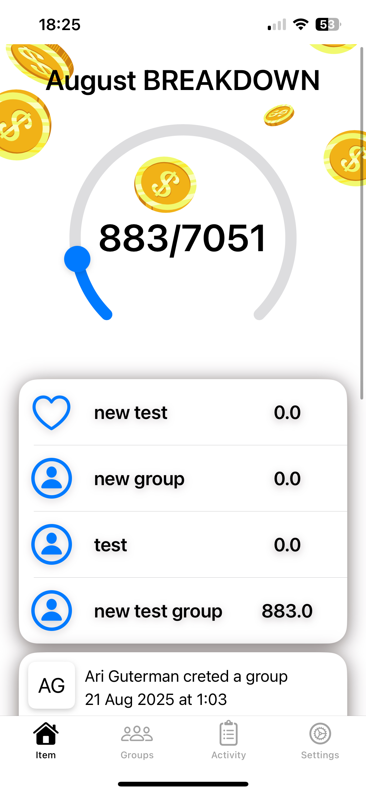
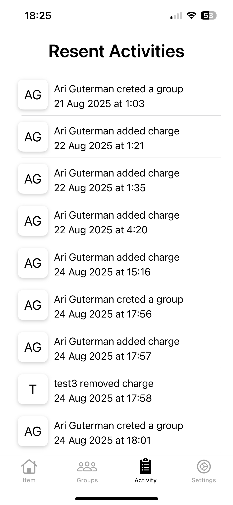
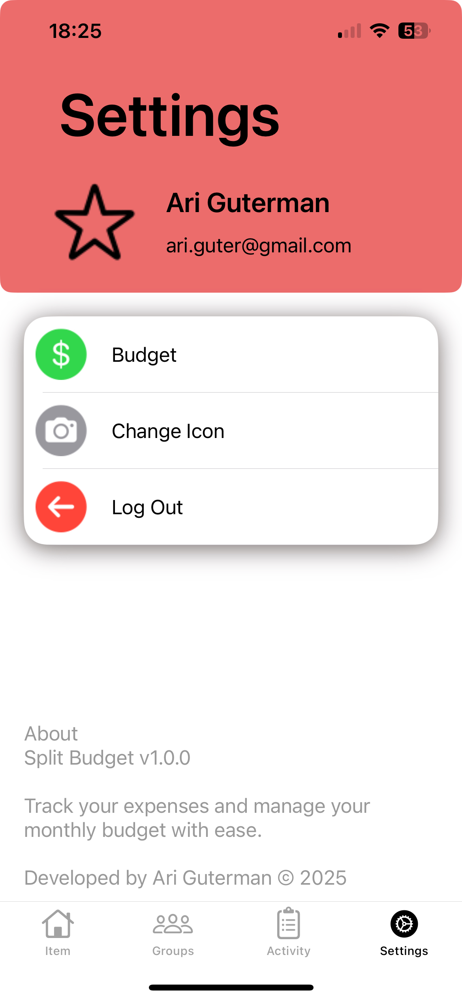

# Activity Screen – Scrollable Layout with Static Tables (UIKit)

This iOS app is designed to help users manage shared group expenses in a simple and transparent way.  
It allows people to create groups, add charges, and track activities in real time using **Firebase Firestore** as the backend.

---

## 🔑 Core Features

- **User Authentication** – Secure login and account handling with Firebase Auth.  
- **Groups Management** – Create and join groups, see who’s in them, and view group details.  
- **Charges Tracking** – Add charges with category icons, amounts, and descriptions.  
- **Activities Feed** – Every action (adding/removing a charge, joining/leaving a group) is logged and displayed.  
- **Invites System** – Users can invite others to groups and manage invites (accept/decline) inside the app.  
- **Realtime Updates** – Firestore listeners keep data in sync across devices without manual refresh.  
- **MVVM Architecture** – Clean separation of logic using ViewModels and Repositories for better maintainability.  
- **Custom UI** – Static tables (like iOS Settings), dynamic tables, and custom cells for an intuitive interface.  
- **User Icons & Categories** – Support for SF Symbols and custom category icons stored in Firebase Storage.  

---

## 🛠 Tech Stack

- **Language:** Swift (UIKit + Storyboard)  
- **Architecture:** MVVM with Repository layer  
- **Backend:** Firebase (Auth, Firestore, Storage)  
- **UI:** UIKit, Auto Layout, Custom Cells, Static Tables  

