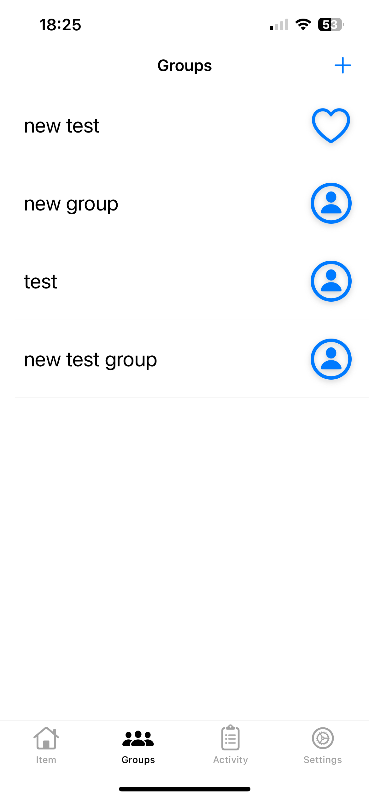

Activity Screen – Scrollable Layout with Static Tables (UIKit)

This iOS app is designed to help users manage shared group expenses in a simple and transparent way.
It allows people to create groups, add charges, and track activities in real time using Firebase Firestore as the backend.

🔑 Core Features
	•	User Authentication – Secure login and account handling with Firebase Auth.
	•	Groups Management – Create and join groups, see who’s in them, and view group details.
	•	Charges Tracking – Add charges with category icons, amounts, and descriptions.
	•	Activities Feed – Every action (adding/removing a charge, joining/leaving a group) is logged and displayed.
	•	Invites System – Users can invite others to groups and manage invites (accept/decline) inside the app.
	•	Realtime Updates – Firestore listeners keep data in sync across devices without manual refresh.
	•	MVVM Architecture – Clean separation of logic using ViewModels and Repositories for better maintainability.
	•	Custom UI – Static tables (like iOS Settings), dynamic tables, and custom cells for an intuitive interface.
	•	User Icons & Categories – Support for SF Symbols and custom category icons stored in Firebase Storage.

🛠 Tech Stack
	•	Language: Swift (UIKit + Storyboard)
	•	Architecture: MVVM with Repository layer
	•	Backend: Firebase (Auth, Firestore, Storage)
	•	UI: UIKit, Auto Layout, Custom Cells, Static Tables

